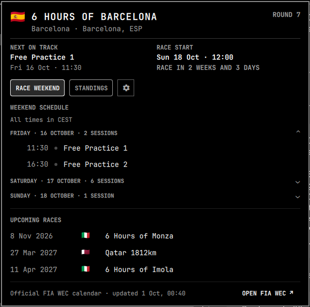

# Omarchy WEC

An Omarchy bar plugin for upcoming FIA World Endurance Championship events.

It shows the next race or active weekend session in the bar. Click the widget
for the event panel, which includes the race countdown, venue, format, weekend
schedule when available, and upcoming races.



## Data sources

- Calendar and event data: [FIA WEC](https://www.fiawec.com/)
- The plugin only makes bounded HTTPS requests to the official calendar.

## Installation

Install and enable the plugin with Omarchy:

```bash
omarchy plugin add https://github.com/yubinex/omarchy-wec.git --enable
```

Update it later with:

```bash
omarchy plugin update yubinex.wec --yes
```

## Controls

- Left click: open or close the event panel
- Escape: close the open event panel
- Middle click: refresh the calendar
- Right click: open the official FIA WEC site

## Trademark notice

FIA WEC and the WEC logo are trademarks of their respective owners. This
unofficial plugin is not affiliated with or endorsed by the FIA, the ACO, or Le
Mans Endurance Management. The WEC logo is loaded from
[Wikimedia Commons](https://commons.wikimedia.org/wiki/File:WEC_Logo.svg), where
it is identified as public-domain artwork; trademark rights still apply. Event
data is fetched directly from fiawec.com and belongs to its owners.

## License

[MIT](LICENSE)
